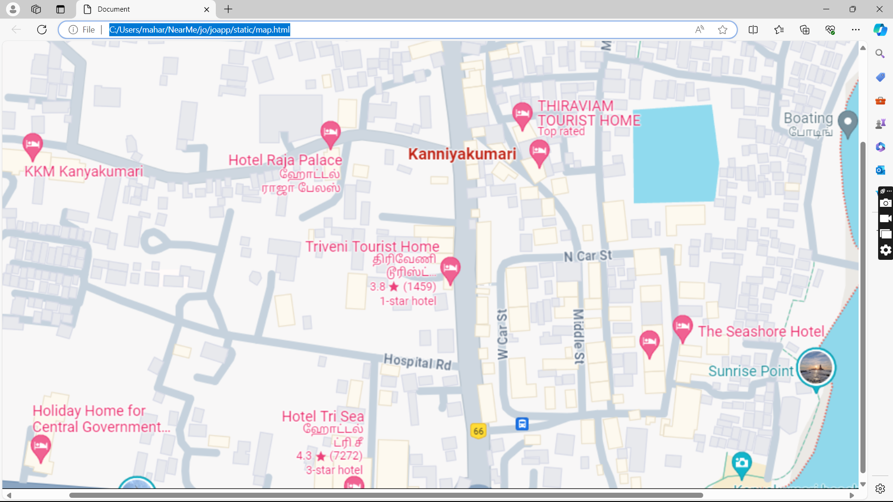
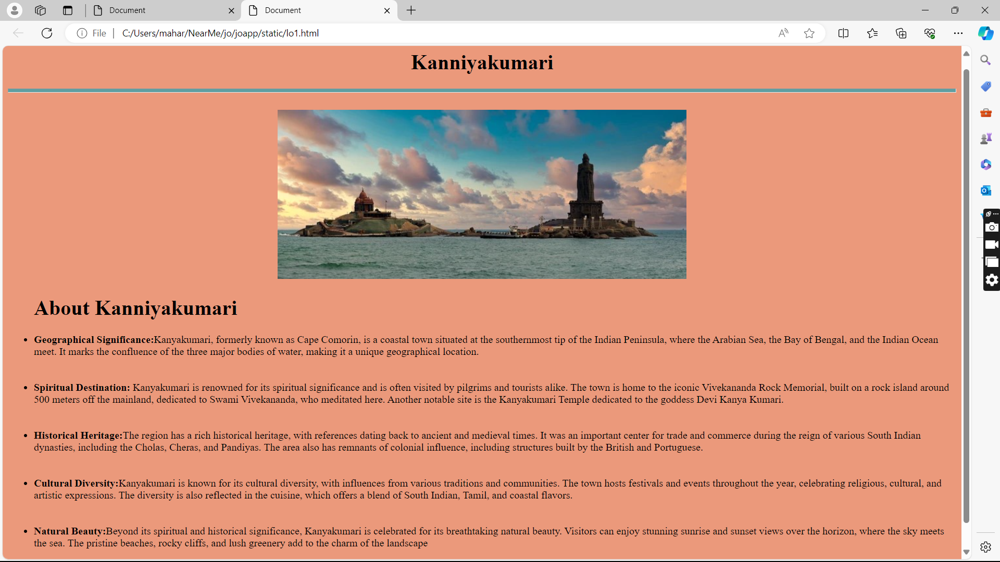
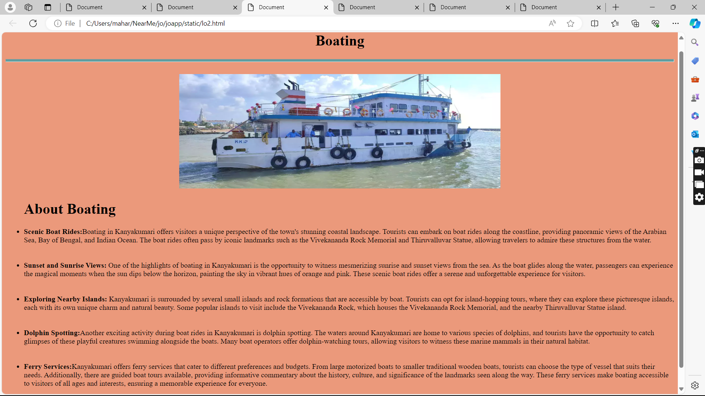
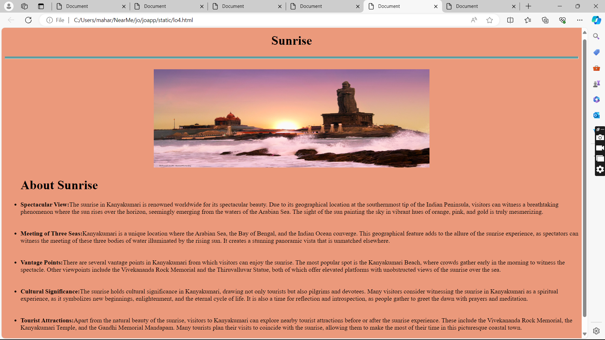
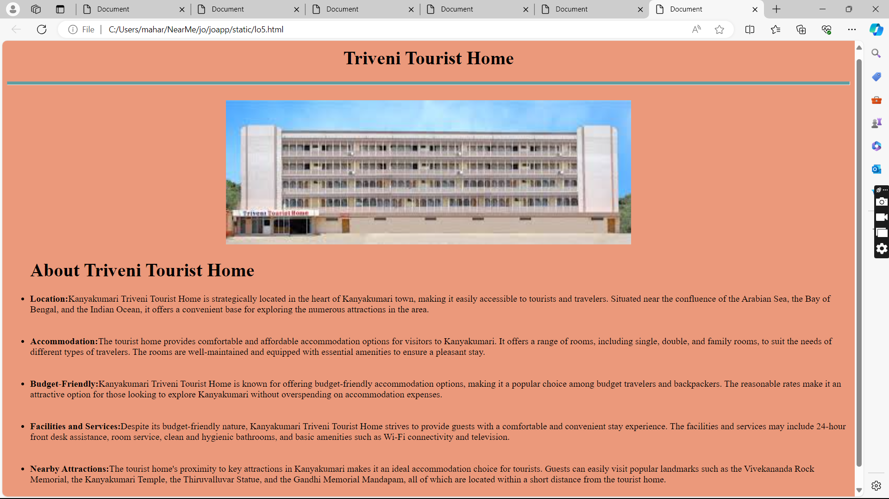

# Ex04 Places Around Me
## Date: 19/04/2024

## AIM
To develop a website to display details about the places around my house.

## DESIGN STEPS

### STEP 1
Create a Django admin interface.

### STEP 2
Download your city map from Google.

### STEP 3
Using ```<map>``` tag name the map.

### STEP 4
Create clickable regions in the image using ```<area>``` tag.

### STEP 5
Write HTML programs for all the regions identified.

### STEP 6
Execute the programs and publish them.

## CODE
### Map
```html
<!DOCTYPE html>
<html lang="en">
<head>
    <meta charset="UTF-8">
    <meta name="viewport" content="width=device-width, initial-scale=1.0">
    <title>Document</title>
</head>
<body>


<map name="image-map">
    <area target="" alt="Kanniyakumari" title="Kanniyakumari" href="lo1.html" coords="811,422,1005,373" shape="rect">
    <area target="" alt="Boating " title="Boating " href="lo2.html" coords="1459,377,1567,312" shape="rect">
    <area target="" alt="Sunrise point" title="Sunrise point" href="lo3.html" coords="1327,788,1540,741" shape="rect">
    <area target="" alt="Holiday Home for Central Government" title="Holiday Home for Central Government" href="lo4.html" coords="152,898,433,812" shape="rect">
    <area target="" alt="Triveni Tourist Home" title="Triveni Tourist Home" href="lo5.html" coords="636,529,870,527,875,657,758,662,736,576,636,574" shape="poly">
</map>
</body>
</html>
```

### kanyakumari
```html
<!DOCTYPE html>
<html lang="en">
<head>
    <meta charset="UTF-8">
    <meta name="viewport" content="width=device-width, initial-scale=1.0">
    <title>Document</title>
    <link rel="stylesheet" href="ext.css">
</head>
<body>
    <center>
        <h1>Kanniyakumari</h1>
        <hr><br>
    </center>
    <center>
        
    </center>
    <ul>
        <h1>About Kanniyakumari</h1>
        <li><strong>Geographical Significance:</strong>Kanyakumari, formerly known as Cape Comorin, is a coastal town situated at the southernmost tip of the Indian Peninsula, where the Arabian Sea, the Bay of Bengal, and the Indian Ocean meet. It marks the confluence of the three major bodies of water, making it a unique geographical location.</li><br><br>
        <li><strong>Spiritual Destination:</strong> Kanyakumari is renowned for its spiritual significance and is often visited by pilgrims and tourists alike. The town is home to the iconic Vivekananda Rock Memorial, built on a rock island around 500 meters off the mainland, dedicated to Swami Vivekananda, who meditated here. Another notable site is the Kanyakumari Temple dedicated to the goddess Devi Kanya Kumari.</li><br><br>
        <li><strong>Historical Heritage:</strong>The region has a rich historical heritage, with references dating back to ancient and medieval times. It was an important center for trade and commerce during the reign of various South Indian dynasties, including the Cholas, Cheras, and Pandiyas. The area also has remnants of colonial influence, including structures built by the British and Portuguese.</li>   <br><br>
        <li><strong>Cultural Diversity:</strong>Kanyakumari is known for its cultural diversity, with influences from various traditions and communities. The town hosts festivals and events throughout the year, celebrating religious, cultural, and artistic expressions. The diversity is also reflected in the cuisine, which offers a blend of South Indian, Tamil, and coastal flavors.</li><br><br>
        <li><strong>Natural Beauty:</strong>Beyond its spiritual and historical significance, Kanyakumari is celebrated for its breathtaking natural beauty. Visitors can enjoy stunning sunrise and sunset views over the horizon, where the sky meets the sea. The pristine beaches, rocky cliffs, and lush greenery add to the charm of the landscape</li><br><br>
    </ul>
</body>
</html>
```

### Boating
```html
<!DOCTYPE html>
<html lang="en">
<head>
    <meta charset="UTF-8">
    <meta name="viewport" content="width=device-width, initial-scale=1.0">
    <title>Document</title>
    <link rel="stylesheet" href="ext.css">
</head>
<body>
    <center>
        <h1>Boating</h1>
        <hr><br>
    </center>
    <center>
        
    </center>
    <ul>
        <h1>About Boating</h1>
        <li><strong>Scenic Boat Rides:</strong>Boating in Kanyakumari offers visitors a unique perspective of the town's stunning coastal landscape. Tourists can embark on boat rides along the coastline, providing panoramic views of the Arabian Sea, Bay of Bengal, and Indian Ocean. The boat rides often pass by iconic landmarks such as the Vivekananda Rock Memorial and Thiruvalluvar Statue, allowing travelers to admire these structures from the water.</li><br><br>
        <li><strong>Sunset and Sunrise Views: </strong> One of the highlights of boating in Kanyakumari is the opportunity to witness mesmerizing sunrise and sunset views from the sea. As the boat glides along the water, passengers can experience the magical moments when the sun dips below the horizon, painting the sky in vibrant hues of orange and pink. These scenic boat rides offer a serene and unforgettable experience for visitors.</li><br><br>
        <li><strong>Exploring Nearby Islands: </strong>Kanyakumari is surrounded by several small islands and rock formations that are accessible by boat. Tourists can opt for island-hopping tours, where they can explore these picturesque islands, each with its own unique charm and natural beauty. Some popular islands to visit include the Vivekananda Rock, which houses the Vivekananda Rock Memorial, and the nearby Thiruvalluvar Statue island.</li>   <br><br>
        <li><strong>Dolphin Spotting:</strong>Another exciting activity during boat rides in Kanyakumari is dolphin spotting. The waters around Kanyakumari are home to various species of dolphins, and tourists have the opportunity to catch glimpses of these playful creatures swimming alongside the boats. Many boat operators offer dolphin-watching tours, allowing visitors to witness these marine mammals in their natural habitat.</li><br><br>
        <li><strong>Ferry Services:</strong>Kanyakumari offers ferry services that cater to different preferences and budgets. From large motorized boats to smaller traditional wooden boats, tourists can choose the type of vessel that suits their needs. Additionally, there are guided boat tours available, providing informative commentary about the history, culture, and significance of the landmarks seen along the way. These ferry services make boating accessible to visitors of all ages and interests, ensuring a memorable experience for everyone.</li><br><br>
    </ul>
</body>
</html>
```

### Sunrise
```html
<!DOCTYPE html>
<html lang="en">
<head>
    <meta charset="UTF-8">
    <meta name="viewport" content="width=device-width, initial-scale=1.0">
    <title>Document</title>
    <link rel="stylesheet" href="ext.css">
</head>
<body>
    <center>
        <h1>Sunrise</h1>
        <hr><br>
    </center>
    <center>
        
    </center>
    <ul>
        <h1>About Sunrise</h1>
        <li><strong>Spectacular View:</strong>The sunrise in Kanyakumari is renowned worldwide for its spectacular beauty. Due to its geographical location at the southernmost tip of the Indian Peninsula, visitors can witness a breathtaking phenomenon where the sun rises over the horizon, seemingly emerging from the waters of the Arabian Sea. The sight of the sun painting the sky in vibrant hues of orange, pink, and gold is truly mesmerizing.</li><br><br>
        <li><strong>Meeting of Three Seas:</strong>Kanyakumari is a unique location where the Arabian Sea, the Bay of Bengal, and the Indian Ocean converge. This geographical feature adds to the allure of the sunrise experience, as spectators can witness the meeting of these three bodies of water illuminated by the rising sun. It creates a stunning panoramic vista that is unmatched elsewhere.</li><br><br>
        <li><strong>Vantage Points:</strong>There are several vantage points in Kanyakumari from which visitors can enjoy the sunrise. The most popular spot is the Kanyakumari Beach, where crowds gather early in the morning to witness the spectacle. Other viewpoints include the Vivekananda Rock Memorial and the Thiruvalluvar Statue, both of which offer elevated platforms with unobstructed views of the sunrise over the sea.</li>   <br><br>
        <li><strong>Cultural Significance:</strong>The sunrise holds cultural significance in Kanyakumari, drawing not only tourists but also pilgrims and devotees. Many visitors consider witnessing the sunrise in Kanyakumari as a spiritual experience, as it symbolizes new beginnings, enlightenment, and the eternal cycle of life. It is also a time for reflection and introspection, as people gather to greet the dawn with prayers and meditation.</li><br><br>
        <li><strong>Tourist Attractions:</strong>Apart from the natural beauty of the sunrise, visitors to Kanyakumari can explore nearby tourist attractions before or after the sunrise experience. These include the Vivekananda Rock Memorial, the Kanyakumari Temple, and the Gandhi Memorial Mandapam. Many tourists plan their visits to coincide with the sunrise, allowing them to make the most of their time in this picturesque coastal town.</li><br><br>
    </ul>
</body>
</html>
```

### Holiday Home for Central Government
```html
<!DOCTYPE html>
<html lang="en">
<head>
    <meta charset="UTF-8">
    <meta name="viewport" content="width=device-width, initial-scale=1.0">
    <title>Document</title>
    <link rel="stylesheet" href="ext.css">
</head>
<body>
    <center>
        <h1>Holiday Homes for Central Government</h1>
        <hr><br>
    </center>
    <center>
        
    </center>
    <ul>
        <h1>About Holiday Homes for Central Government</h1>
        <li><strong>Accommodation Facilities: </strong> Kanyakumari offers holiday homes for Central Government employees, providing comfortable accommodation options during their visit to the region. These holiday homes are typically equipped with modern amenities and facilities to ensure a pleasant stay for guests. They may include furnished rooms, air conditioning, dining areas, and recreational spaces.</li><br><br>
        <li><strong>Affordable Rates:</strong>The holiday homes in Kanyakumari for Central Government employees often offer accommodation at subsidized rates, making them an affordable option for those on official visits or vacationing with their families. These rates are usually lower compared to commercial hotels and resorts, allowing government employees to enjoy their stay without breaking the bank.</li><br><br>
        <li><strong>Convenient Locations:</strong>The holiday homes are strategically located in convenient areas of Kanyakumari, providing easy access to tourist attractions, transportation hubs, and other amenities. Whether employees wish to explore the beaches, temples, or cultural sites, they can find holiday homes situated in close proximity to these places of interest</li>   <br><br>
        <li><strong>Booking Procedures:</strong>Central Government employees can typically book holiday homes in Kanyakumari through designated channels or online platforms managed by the concerned government departments or agencies. The booking process may involve submitting necessary documents and adhering to specific guidelines and regulations set by the authorities.</li><br><br>
        <li><strong>Security and Comfort: </strong>Holiday homes for Central Government employees in Kanyakumari prioritize the safety and comfort of their guests. These accommodations often have security measures in place to ensure the well-being of residents, including CCTV surveillance, gated entrances, and round-the-clock staff assistance. Additionally, amenities such as power backup, Wi-Fi connectivity, and housekeeping services contribute to a comfortable and hassle-free stay experience.</li><br><br>
    </ul>
</body>
</html>
```

### Triveni Tourist Home
```html
<!DOCTYPE html>
<html lang="en">
<head>
    <meta charset="UTF-8">
    <meta name="viewport" content="width=device-width, initial-scale=1.0">
    <title>Document</title>
    <link rel="stylesheet" href="ext.css">
</head>
<body>
    <center>
        <h1>Triveni Tourist Home</h1>
        <hr><br>
    </center>
    <center>
        
    </center>
    <ul>
        <h1>About Triveni Tourist Home</h1>
        <li><strong>Location:</strong>Kanyakumari Triveni Tourist Home is strategically located in the heart of Kanyakumari town, making it easily accessible to tourists and travelers. Situated near the confluence of the Arabian Sea, the Bay of Bengal, and the Indian Ocean, it offers a convenient base for exploring the numerous attractions in the area.</li><br><br>
        <li><strong>Accommodation:</strong>The tourist home provides comfortable and affordable accommodation options for visitors to Kanyakumari. It offers a range of rooms, including single, double, and family rooms, to suit the needs of different types of travelers. The rooms are well-maintained and equipped with essential amenities to ensure a pleasant stay.</li><br><br>
        <li><strong>Budget-Friendly:</strong>Kanyakumari Triveni Tourist Home is known for offering budget-friendly accommodation options, making it a popular choice among budget travelers and backpackers. The reasonable rates make it an attractive option for those looking to explore Kanyakumari without overspending on accommodation expenses.</li>   <br><br>
        <li><strong>Facilities and Services:</strong>Despite its budget-friendly nature, Kanyakumari Triveni Tourist Home strives to provide guests with a comfortable and convenient stay experience. The facilities and services may include 24-hour front desk assistance, room service, clean and hygienic bathrooms, and basic amenities such as Wi-Fi connectivity and television.</li><br><br>
        <li><strong>Nearby Attractions:</strong>The tourist home's proximity to key attractions in Kanyakumari makes it an ideal accommodation choice for tourists. Guests can easily visit popular landmarks such as the Vivekananda Rock Memorial, the Kanyakumari Temple, the Thiruvalluvar Statue, and the Gandhi Memorial Mandapam, all of which are located within a short distance from the tourist home.</li><br><br>
    </ul>
</body>
</html>
```

## External CSS
```css
hr{
    background-color: cadetblue;
    height: 5px;
}
body{
    background-color: rgb(235, 153, 123);
}
```

## OUTPUT











## RESULT
The program for implementing image maps using HTML is executed successfully.
